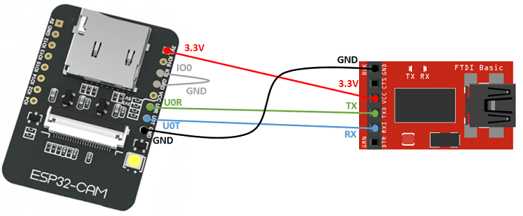

# ESP32Cam modules

CAH 2019-10-27

- Device: ESP32
- Board: esp-wrover-kit

## Uploading the first firmware via an USB-serial adapter

1. Wring diagram for ESP32Cam (Wrover-kit) and CP21029 FTDI module:

    

2. Procedure to put the ESP32Cam module in programming state:

   - Wire-up power, GND, Tx and Rx according to the diagram above
   - Connect GPIO-0 to GND (shown in gray on the diagram above)

3. Upload the firmware via serial:

    `esphome espcam01.yaml run --upload-port=/dev/ttyS4`

   - Note: `/dev/ttyS4` above corresponds to serial port `COM4`
   - Just before esphome starts to upload the firmware,  click the 'reset' button on the *bottom* of the module
   - After uploading the firmware, disconnect GPIO-0 from GND and hit reset again to boot the new firmware

   Since version `1.14.0` of ESPHome, the serial upload speed was increased from 115200 to 460800 baud. This causes problems with some USB-to-UART chips. If facing upload problems, use `esptoop.py` to upload the compiled firmware specifying a lower upload speed:

   `~/.local/bin/esptool.py --before default_reset --after hard_reset --baud 115200 --chip esp8266 --port /dev/ttyS4 write_flash 0x0 espcam01/.pioenvs/espcam01/firmware.bin`

## Module detection in Home-Assistant

- Go to Settings > Integrations, and add a new ESPHome integration
- For the hostname, use the device's hostname, for instance, `esp32cam01.local`
- Must be using Home Assistant v0.91 or greater for ESP32Cam integration

## Brownout detection error

If the power supply feeding the board does not mantain exactly 3.3v or 5v, the board will not boot and the following error can be seen in the serial output:

```text
[I][logger:166]: Log initialized
[C][status_led:014]: Setting up Status LED...
[C][ota:366]: There have been 2 suspected unsuccessful boot attempts.
[I][app:029]: Running through setup()...
[D][text_sensor:015]: 'ESP32Cam01 Version': Sending state '1.15.3 Nov 30 2020, 19:10:36'
[C][wifi:033]: Setting up WiFi...

Brownout detector was triggered

ets Jun  8 2016 00:22:57

rst:0xc (SW_CPU_RESET),boot:0x13 (SPI_FAST_FLASH_BOOT)
configsip: 0, SPIWP:0xee
clk_drv:0x00,q_drv:0x00,d_drv:0x00,cs0_drv:0x00,hd_drv:0x00,wp_drv:0x00
mode:DIO, clock div:2
load:0x3fff0018,len:4
load:0x3fff001c,len:928
ho 0 tail 12 room 4
load:0x40078000,len:9280
load:0x40080400,len:5860
entry 0x40080698
```