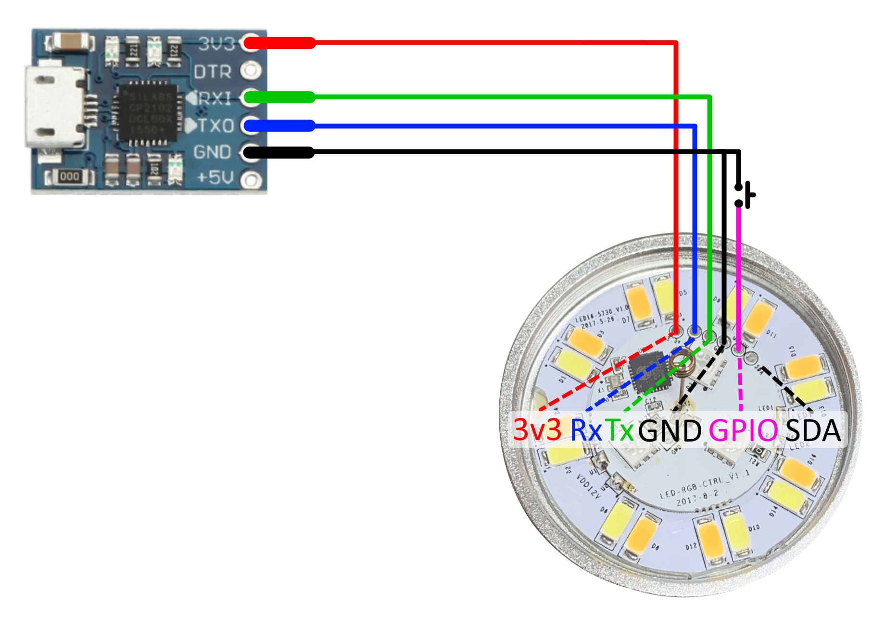

# Flashing a Sonoff B1 LED bulb with ESPHome

CAH 2022-04-13

## References

- <https://www.igorkromin.net/index.php/2017/10/08/hacking-the-sonoff-b1-wifi-led-bulb-to-run-custom-firmware/>
- <https://blog.moddable.com/blog/hacking-sonoff-b1/>
- <https://tasmota.github.io/docs/devices/Sonoff-B1/#serial-flashing>
- MY9231/MY9291 LED driver: <https://esphome.io/components/output/my9231.html>
- <https://www.itead.cc/wiki/Sonoff>

## Wiring

- For this procedure the Sonoff B1 must be disconnected from mains power
- Sonoff B1 is a 3v3 device, connecting it to a 5v supply will damage the board
- Connect the Sonoff to a USB UART following the diagram below

## Flashing procedure

1. To put the Sonoff B1 in flashing mode, connect GPIO0 to ground before before applying power to the device
2. Apply power, holding GPIO0 to ground for a couple of seconds
3. Release GPIO0 and start flashing the firmware

    Linux: `esphome my_device.yaml run --upload-port=/dev/ttyS4`

    Windows: `esphome my_device.yaml run --upload-port=COM4`

4. Before re-assembling the device, run an OTA update to check that everything is correct
