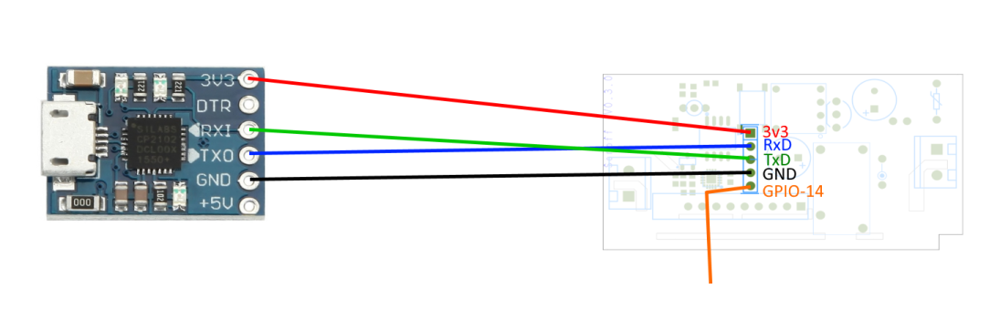

# Flashing a Sonoff Basic device with ESPHome

CAH 2020-07-19

## References

- <https://esphome.io/devices/sonoff_basic.html>
- <https://randomnerdtutorials.com/how-to-flash-a-custom-firmware-to-sonoff/>
- <https://www.itead.cc/wiki/Sonoff>

## Wiring

- For this procedure the Sonoff Basic must be disconnected from mains power
- Sonoff Basic is a 3v3 device, connecting it to a 5v supply will damage the board
- Connect the Sonoff to a USB UART following the diagram below

## Flashing procedure

1. To put the Sonoff in flashing mode, hold down the button before applying power to the device
2. Apply power, holding the button for a couple of seconds
3. Release the button and start flashing the firmware

    `esphome my_device.yaml run --upload-port=/dev/ttyS4`

4. Before re-assembling the device, run an OTA update to check that everything is correct
