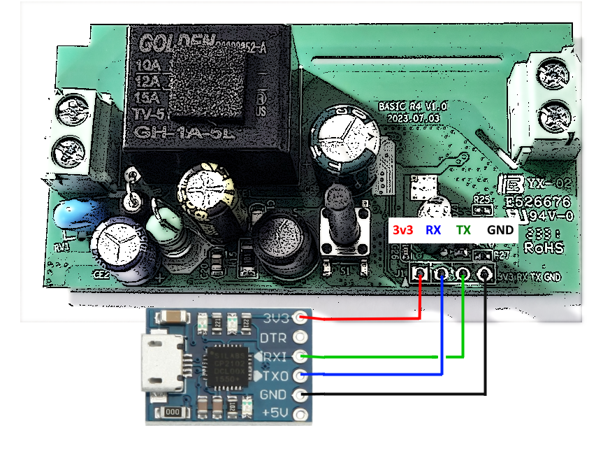

# Flashing a Sonoff Basic R4 (Magic Switch) device with ESPHome

CAH 2025-04-26

**Note:** this device is based on an ESP32 board.

## References

- <https://devices.esphome.io/devices/Sonoff-BASIC-R4-v1.0>
- <https://randomnerdtutorials.com/how-to-flash-a-custom-firmware-to-sonoff/>
- <https://itead.cc/product/sonoff-basicr4-wi-fi-smart-switch/>
- <https://www.itead.cc/wiki/Sonoff>

## Wiring

- For this procedure the Sonoff Basic must be disconnected from mains power
- Sonoff Basic is a 3v3 device, connecting it to a 5v supply will damage the board
- Connect the Sonoff to a USB UART following the diagram below



## Flashing procedure

1. To put the Sonoff in flashing mode, hold down the button before applying power to the device
2. Apply power, holding the button for a couple of seconds
3. Release the button and start flashing the firmware

    Linux: `esphome my_device.yaml run --device=/dev/ttyS4`

    Windows: `esphome my_device.yaml run --device=COM4`

4. Before re-assembling the device, run an OTA update to check that everything is correct

## Console log of first firmware upload (via serial)

```text
INFO ESPHome 2024.4.0
INFO Reading configuration sonoff_basic_r4_01.yaml...
INFO Updating https://github.com/ssieb/esphome_components@None
WARNING 'sonoff_basic_r4_01': Using the '_' (underscore) character in the hostname is discouraged as it can cause problems with some DHCP and local name services. For more information, see https://esphome.io/guides/faq.html#why-shouldn-t-i-use-underscores-in-my-device-name
WARNING GPIO9 is a strapping PIN and should only be used for I/O with care.
Attaching external pullup/down resistors to strapping pins can cause unexpected failures.
See https://esphome.io/guides/faq.html#why-am-i-getting-a-warning-about-strapping-pins
INFO Generating C++ source...
INFO Compiling app...
Processing sonoff_basic_r4_01 (board: esp32-c3-devkitm-1; framework: arduino; platform: platformio/espressif32@5.4.0)
--------------------------------------------------------------------------------
HARDWARE: ESP32C3 160MHz, 320KB RAM, 4MB Flash
 - toolchain-riscv32-esp @ 8.4.0+2021r2-patch5
Dependency Graph
|-- AsyncTCP-esphome @ 2.1.3
|-- WiFi @ 2.0.0
|-- FS @ 2.0.0
|-- Update @ 2.0.0
|-- ESPAsyncWebServer-esphome @ 3.1.0
|-- DNSServer @ 2.0.0
|-- ESPmDNS @ 2.0.0
RAM:   [=         ]  11.2% (used 36540 bytes from 327680 bytes)
Flash: [=====     ]  46.6% (used 855358 bytes from 1835008 bytes)
========================= [SUCCESS] Took 6.48 seconds =========================
INFO Successfully compiled program.
esptool.py v4.7.0
Serial port COM5
Connecting....
Chip is ESP32-C3 (QFN32) (revision v0.4)
Features: WiFi, BLE, Embedded Flash 4MB (XMC)
Crystal is 40MHz
MAC: 84:fc:e6:85:66:d0
Uploading stub...
Running stub...
Stub running...
Changing baud rate to 460800
Changed.
Configuring flash size...
Auto-detected Flash size: 4MB
Flash will be erased from 0x00010000 to 0x000e4fff...
Flash will be erased from 0x00000000 to 0x00003fff...
Flash will be erased from 0x00008000 to 0x00008fff...
Flash will be erased from 0x0000e000 to 0x0000ffff...
Compressed 869632 bytes to 524807...
Wrote 869632 bytes (524807 compressed) at 0x00010000 in 15.0 seconds (effective 465.2 kbit/s)...
Hash of data verified.
Compressed 12944 bytes to 9299...
Wrote 12944 bytes (9299 compressed) at 0x00000000 in 0.4 seconds (effective 233.4 kbit/s)...
Hash of data verified.
Compressed 3072 bytes to 144...
Wrote 3072 bytes (144 compressed) at 0x00008000 in 0.1 seconds (effective 384.9 kbit/s)...
Hash of data verified.
Compressed 8192 bytes to 47...
Wrote 8192 bytes (47 compressed) at 0x0000e000 in 0.1 seconds (effective 508.6 kbit/s)...
Hash of data verified.

Leaving...
Hard resetting via RTS pin...
INFO Successfully uploaded program.
INFO Starting log output from COM5 with baud rate 115200
```