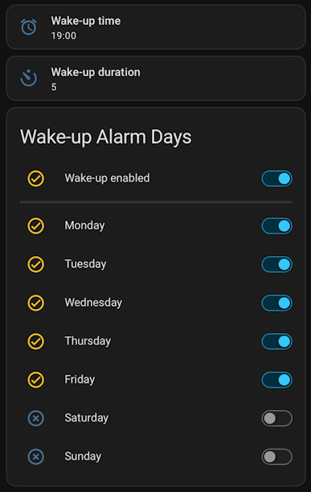

# Wake-up Light Modules based on Sonoff B1

CAH 2022-04-21

- Device: Sonoff B1
- platform: ESP8266
- board: esp01_1m

## Introduction

These devices are used primarily as "soft wake-up lights". Any lamp will do, there are two Sonoff B1 in use as well as a WLED strip. The automation to run the sunrise simulation is described below.

## Links

- [ESPHome Time component - SNTP Time Source](https://esphome.io/components/time.html#sntp-time-source)
- [Wake-up light alarm with sunrise effect](https://community.home-assistant.io/t/wake-up-light-alarm-with-sunrise-effect/255193)

## Automation description

The sunrise wake-up alarm automation is based on the original blueprint by sbyx found here: <https://gist.github.com/sbyx/96c43b13b90ae1c35b872313ba1d2d2d> (linked from the community post in the previous section)

The original blueprint was forked and modified as follow:

- Removed the "Alarm timestamp sensor"
- Removed the input variable "Manual alarm time" and replaced it with a "Manual alarm time helper" to select a pre-cofigured input_datetime helper
- Removed the input variable "Sunrise duration" and replaced it with "Sunrise duration helper" to select a pre-cofigured input_number helper

The modified blueprint is available here: <https://gist.github.com/heckler/b7710742d19418274ca5568fc36a5269>

Using a templated sensor for the "Additional Entity to Check", the following dashboard is created to manage the time, duration and days of the week for the alarm:



The wake-up time is an `input_datetime` helper with `has_date: false` and `has_time: true` and the wake-up duration is an `input_number` helper.

The toggles for the overall "alarm should run" (a global on/off, think vacation mode) and for the individual days of the week are created as follow:

- For each instance of the automation there are 8 `input_boolean` helpers, as follow:

```yaml
input_boolean:
  claudio_wakeup_enabled:
  claudio_wakeup_monday:
  claudio_wakeup_tuesday:
  claudio_wakeup_wednesday:
  claudio_wakeup_thursday:
  claudio_wakeup_friday:
  claudio_wakeup_saturday:
  claudio_wakeup_sunday:
```

Then there is a templated sensor that checks the overall "enabled" helper and the helper for the current day of the week:

```yaml
template:

# determine if Claudio's wake-up light should run today:
- sensor:
  - default_entity_id: sensor.claudio_wakeup_should_run
    name: claudio_wakeup_should_run
    state:  >
      
      
      
      {{ is_state('input_boolean.claudio_wakeup_enabled', 'on') and is_state(entity_id, 'on') }}
```

The templated sensor above, `sensor.claudio_wakeup_should_run` is then configured as the "Additional entity to check" in the automation created from the blueprint.

The code to display the toggles on the dashboard is like this:

```yaml
color: state
type: entities
entities:
  - entity: input_boolean.claudio_wakeup_enabled
    name: Wake-up enabled
  - type: divider
    style:
      height: 3px
  - entity: input_boolean.claudio_wakeup_monday
    name: Monday
  - entity: input_boolean.claudio_wakeup_tuesday
    name: Tuesday
  - entity: input_boolean.claudio_wakeup_wednesday
    name: Wednesday
  - entity: input_boolean.claudio_wakeup_thursday
    name: Thursday
  - entity: input_boolean.claudio_wakeup_friday
    name: Friday
  - entity: input_boolean.claudio_wakeup_saturday
    name: Saturday
  - entity: input_boolean.claudio_wakeup_sunday
    name: Sunday
title: Wake-up Alarm Days
show_header_toggle: false
```

## Automation blueprint

The blueprint is sourced from the gist URL, but for documentation purposes, this is the version at the time of writing this doc:

```yaml
blueprint:
  name: Wake-up light alarm with sunrise effect (heckler)
  description: 'A wake-up light alarm with a brightness and color temperature sunrise
    effect. Note: Requires date_time_iso sensor in configuration, not manually executable!'
  domain: automation
  input:
    light_entity:
      name: Wake-up light entity
      description: The light to control. Turning it off during the sunrise will keep
        it off. Color temperature range is auto-detected.
      selector:
        entity:
          domain: light
    manual_time_helper:
      name: Manual alarm time helper
      description: Select an input_datetime helper containing the alarm time.
      selector:
        entity:
          domain: input_datetime
    check_entity:
      name: Additional entity to check before sunrise is triggered
      description: If set, checks if entity is 'on' or 'home' before triggering. Use
        e.g. a (workday) sensor, device_tracker or person entity.
      default: none
      selector:
        entity: {}
    sunrise_duration_helper:
      name: Sunrise duration helper
      description: Select an input_number helper containing the sunrise duration in minutes.
      selector:
        entity:
          domain: input_number
    start_brightness:
      name: Minimum brightness
      description: The brightness to start with. Some lights ignore very low values
        and may turn on with full brightness instead!
      default: 1
      selector:
        number:
          min: 1.0
          max: 255.0
          step: 1.0
          mode: slider
    end_brightness:
      name: Maximum brightness
      description: The brightness will be transitioned from the minimum to the configured
        value.
      default: 254
      selector:
        number:
          min: 5.0
          max: 255.0
          step: 1.0
          mode: slider
    min_mired:
      name: Minimum color temperature
      description: 'The minimum color temperature to use. (0: lowest supported)'
      default: 0
      selector:
        number:
          min: 0.0
          max: 500.0
          step: 5.0
          mode: slider
          unit_of_measurement: mired
    pre_sunrise_actions:
      name: Pre-sunrise actions
      description: Optional actions to run before sunrise starts.
      default: []
      selector:
        action: {}
    post_sunrise_actions:
      name: Post-sunrise actions
      description: Optional actions to run after sunrise ends (around the alarm time).
      default: []
      selector:
        action: {}
  source_url: https://gist.github.com/sbyx/96c43b13b90ae1c35b872313ba1d2d2d
variables:
  light_entity: !input 'light_entity'
  sunrise_duration_helper: !input 'sunrise_duration_helper'
  manual_time_helper: !input 'manual_time_helper'
  sunrise_duration: '{{ states(sunrise_duration_helper) | float(0) }}'
  manual_time: '{{ states(manual_time_helper) }}'
  start_brightness: !input 'start_brightness'
  end_brightness: !input 'end_brightness'
  range_brightness: '{{float(end_brightness)-float(start_brightness)}}'
  seconds: '{{float(sunrise_duration) * 60}}'
  min_mired: !input 'min_mired'
  start_mired: '{{state_attr(light_entity, ''max_mireds'')}}'
  end_mired: '{{[state_attr(light_entity, ''min_mireds'')|int(0), min_mired|int(0)]|max}}'
  tick_time: '{{float(seconds) / float(range_brightness)}}'
  check_entity: !input 'check_entity'
trigger:
- platform: time_pattern
  minutes: '*'
condition: []
action:
- wait_template: >
    {{ 0 < as_timestamp(states('sensor.date') ~ ' ' ~ manual_time)
       - as_timestamp(states('sensor.date_time_iso'))
       <= float(seconds)
       and states(check_entity) | lower in ['unknown', 'on', 'home', 'true'] }}
- choose: []
  default: !input 'pre_sunrise_actions'
- condition: template
  value_template: >
    {{ 0 < as_timestamp(states('sensor.date') ~ ' ' ~ manual_time)
       - as_timestamp(now())
       <= float(seconds)
       and states(check_entity) | lower in ['unknown', 'on', 'home', 'true'] }}
- choose:
  - conditions:
    - '{{state_attr(light_entity, ''min_mireds'') != None}}'
    sequence:
    - service: light.turn_on
      data:
        brightness: '{{start_brightness}}'
        color_temp: '{{start_mired}}'
      entity_id: !input 'light_entity'
  default:
  - service: light.turn_on
    data:
      brightness: '{{start_brightness}}'
    entity_id: !input 'light_entity'
- repeat:
    while:
    - '{{0 < as_timestamp(states(''sensor.date'') ~ '' '' ~ manual_time)
      - as_timestamp(now()) <= float(seconds)}}'
    sequence:
    - delay: '{{tick_time}}'
    - choose:
      - conditions:
        - '{{0 < state_attr(light_entity, ''brightness'') | int(0) < end_brightness | int}}'
        - '{{0 < as_timestamp(states(''sensor.date'') ~ '' '' ~ manual_time)
          - as_timestamp(now()) <= float(seconds)}}'
        sequence:
        - choose:
          - conditions:
            - '{{state_attr(light_entity, ''min_mireds'') != None}}'
            sequence:
            - service: light.turn_on
              data:
                brightness: >-
                  {{ (float(end_brightness) - (float(range_brightness) *
                    (as_timestamp(states('sensor.date') ~ ' ' ~ manual_time)
                    - as_timestamp(now())) / float(seconds))) | int(0) }}
                color_temp: >-
                  {{ (float(end_mired) + (float(start_mired) - float(end_mired))
                    * ((as_timestamp(states('sensor.date') ~ ' ' ~ manual_time)
                    - as_timestamp(now())) / float(seconds))) | int(0) }}
              entity_id: !input 'light_entity'
          default:
          - service: light.turn_on
            data:
              brightness: >-
                {{ (float(end_brightness) - (float(range_brightness) *
                  (as_timestamp(states('sensor.date') ~ ' ' ~ manual_time)
                   - as_timestamp(now())) / float(seconds))) | int(0) }}
            entity_id: !input 'light_entity'
- choose: []
  default: !input 'post_sunrise_actions'
mode: single
max_exceeded: silent
```