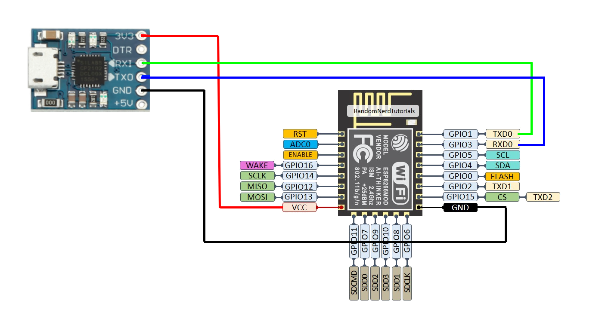
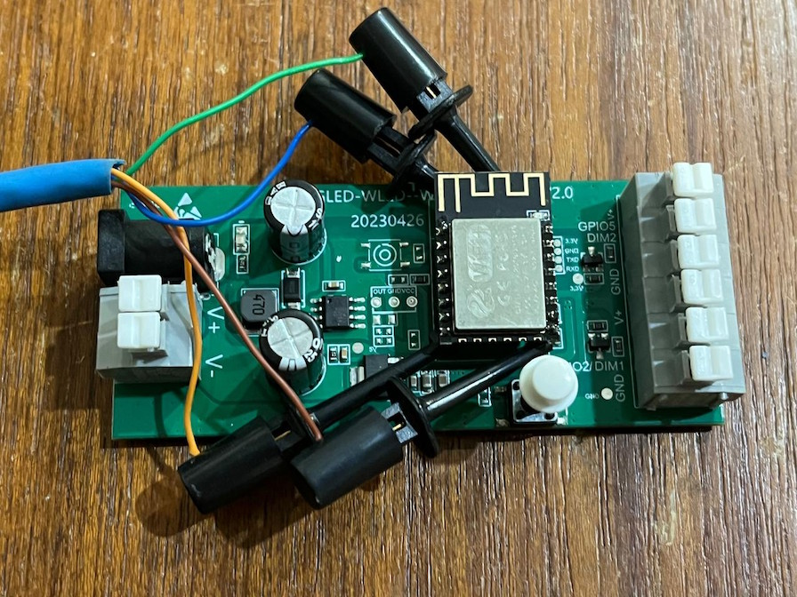
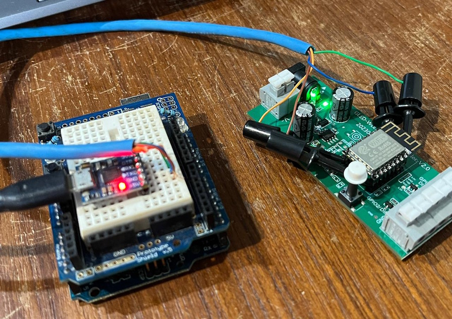
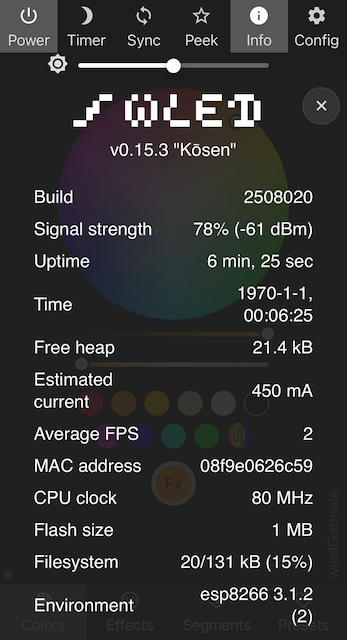

# WLED Modules

CAH 2023-12-15

## Links and references

- [Home Assistant WLED integration](https://www.home-assistant.io/integrations/wled/)
- [WLED project and documentation](https://kno.wled.ge/)
- [LED strip power calculator](https://wled-calculator.github.io/)

### GLEDOPTO WLED Strip Controller GL-C-008WL

- [Pre-flashed WLED strip controller from AliExpress](https://www.aliexpress.com/item/1005005861600793.html)
- [Manufacturer's product page](https://www.gledopto.com/h-col-420.html)
- Firmware version shipped: WLed v0.14.0 "Hoshi" build 2310130

### WS2812B 5050 RGB DC5V Led Strip

- [Aliexpress product SKU 32682015405](https://www.aliexpress.com/item/32682015405.html)
- 30 LEDs per 1m, total of 150 LEDs for a 5m strip
- Power consumption: 0.3W per RGB LED, or 45W for the entire strip

### Power supply options

- <https://www.aliexpress.com/item/33051556213.html>
- <https://www.aliexpress.com/item/1005002843829663.html>

### Manually re-flashing the firmware (un-bricking)

One of the devices failed to update and was "bricked" in the process, no longer connected to WiFi and did not start the configuration access point.  It was necessary to manually upload the firmware via serial in order to recover.

#### Connection to the serial adapter

The SoC on a GLEDOPTO GL-C-008WL controller is a standard EPS8266 (not sure on the exact variant).  The pinout and serial connection are displayed below:



The GLEDOPTO module does have serial pads in the PCB, but they are not through-whole, and use a small pitch, making soldering headers very unpractical. On the bright side, the ESP8266 sits on long exposed headers, so using pincers it is possible to hook to the UART and power lines:





#### firmware update

For this module, the "ESP01" variant of the WLed firmware was used, from the Releases page: <https://github.com/wled/WLED/releases>

Just flashing did not work, it was necessary to first erase the flash, then apply the firmware:

```bash
# Note: press and hold the reset button on the device before applying power to the ESP
esptool --port COM5 erase_flash
```

Firmware update: (need to power-cycle the board and hold the button again)

```bash
# Note: press and hold the reset button on the device before applying power to the ESP
esptool --port COM5 write_flash 0x0 /c/Users/heckler/Downloads/WLED_0.15.3_ESP01.bin
```

Programming output:

```log
$ esptool write_flash 0x0 /c/Users/heckler/Downloads/WLED_0.15.3_ESP01.bin
esptool.py v4.7.0
Found 3 serial ports
Serial port COM5
Connecting....
Detecting chip type... Unsupported detection protocol, switching and trying again...
Connecting...
Detecting chip type... ESP8266
Chip is ESP8266EX
Features: WiFi
Crystal is 26MHz
MAC: 08:f9:e0:62:6c:59
Uploading stub...
Running stub...
Stub running...
Configuring flash size...
Flash will be erased from 0x00000000 to 0x000d7fff...
Compressed 884416 bytes to 637874...
Wrote 884416 bytes (637874 compressed) at 0x00000000 in 56.8 seconds (effective 124.6 kbit/s)...
Hash of data verified.

Leaving...
Hard resetting via RTS pin...
```

After flashing and power-cycling again, the device successfully started the captive access point for configuration.


